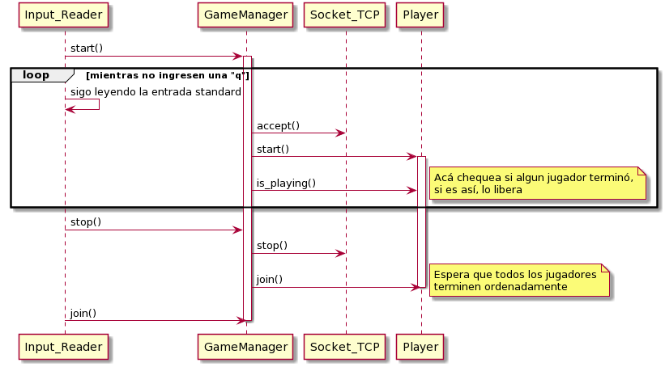

# TP3-Adivina el número

**Apellido y nombre:** Eleonora Luna 
**Padrón:** 96444

**Repositorio de Github:** https://github.com/eleonoraluna/tp3.git

## Informe

### 1. Arquitectura General

#### Client.cpp

Es el main del client el cual recibe un host y un puerto al cual debe conectarse.

```
    Ej: ./client localhost 8080
```

El main se encarga de instanciar un Game y correrlo.

**Clases:**

#### Game

Esta clase se encarga de ir leyendo los comandos que escribe el jugador por consola y ejecutar las acciones
correspondientes. Si el jugador escribe algún comando que no puede ser decodificado para enviar al servidor,
se imprime un mensaje en pantalla notificándolo segun lo exigido en el enunciado. En el caso de que sí sean
comandos válidos, crea una instancia de la clase a la que corresponda el comando (Surrender, Help, numberCommand)
y los ejecuta. Tiene una variable booleana que indica si el jugador sigue jugando o no (en el caso de que haya
ganado o perdido). Mientras esta variable se encuentre en true, seguirá leyendo los comandos del cliente.

#### Encoder

Se encarga de codificar los comandos ingresados por el cliente para enviarlos al servidor. Para enviar estos datos
utiliza un socket de la clase socketTCP del cual es owner. También recibe las respuestas que le envía el servidor
dependiendo el comando que se le envió.

#### Command
##### Help, Surrender y numberCommand

Help Surrender y numberCommand heredan de Command. Representan los comandos que el cliente tiene permitido enviar
al servidor. Cada uno de ellos tiene una referencia al encoder, el cual utilizan para codificar,enviar y recibir los 
mensajes que le corresponden a cada uno. Cada uno tiene su método *encode()* que al ser ejecutado realiza las acciones
correspondientes para cada uno.

#### Socket_TCP
Representa un socket para protocolo TCP. Se encarga de recibir y enviar los buffers que le pasan por parámetros. 
También se encarga de asegurarse de que se envíen y reciban todos los bytes correspondientes.
En particular, contiene un método *stop()* que es utilizado cuando el socket aceptador se queda bloqueado en el accept.
Cuando ingresan una "q" por teclado (para finalizar el servidor) el hilo principal hace que el hilo aceptador (que 
es owner de un socket) cierre su socket, de tal manera de no quedarse bloqueado en el accept y terminar ordenadamente
la partida.

#### Socket_TCPException
Representa las excepciones que se lanzan en la clase Socket_TCP. Éstas son lanzadas cuando surge algun error en los sockets,
tanto como errores de conexión como en el caso de que el send envíe o el recieve reciba 0 bytes.

#### Server.cpp
Es el main del server el cual recibe un puerto al cual debe conectarse y un archivo del cual lee los números a adivinar.

```
    Ej: ./server 8080 server.list
```

El main se encarga de instanciar un Input_Reader y correrlo.

#### Input_Reader
Se encarga de leer de entrada standard si ingresan o no una "q" indicando que se debe terminar la partida.
Instancia un GameManager y lo corre. En el caso de que ingresen una q, le hace un *stop()* y espera a que termine.
Una vez que termina el GameManager, hace uso de una instancia de Printer para imprimir las estadísticas requeridas.

#### Thread
Clase base de la cual heredan las clases GameManager y Player. Representa un thread que va a ejecutar la funcion run()
detallada en las clases hijas.

#### GameManager
Clase que hereda de thread. Representa al hilo aceptador de clientes. Es owner de un socket_TCP el cual utiliza para
ir aceptando clientes. Crea instancias de Player para cada uno de ellos y las corre. Luego, chequea si alguno de ellos 
terminó y los elimina y sino, sigue aceptando clientes. Si el hilo principal le hace *stop()* cierra su socket aceptador
y espera a que todos sus Players terminen de jugar. Hace uso de una instancia de la clase Reader para leer el archivo
que recibió el servidor con los números que deben ser adivinados. Se ejecuta hasta que su variable *is_closed* se marque
como true cuando el hilo ppal le haga *stop()*. Como puede ser accedida tanto por el hilo ppal como por la clase en sí
se la declaró como atómica para que no hayan race conditions.

#### Player
Clase que hereda de thread. Representa cada conexión individual que hace el server con cada cliente. Hace uso de una
instancia de Decoder para enviar y recibir los mensajes codificados con el protocolo establecido. Recibe los comandos
codificados y a partir de ellos realiza las acciones correspondientes. Lleva la cuenta de la cantidad de intentos que
tiene el jugador y conoce el número que debe ser adivinado. Se ejecuta hasta que el jugador adivine el número, se rinda,
o pierda por gastar todos los intentos. Cuando pasa alguna de estas situaciones, su variable *is_playing* se marca
como false indicando la condición de corte. Como esta variable también puede ser accedida por el GameManager se la declaró
como atómica para evitar race conditions.

#### Decoder
Se encarga de decodificar los mensajes que le envía el cliente y también de codificar los mensajes correspondientes
para enviar como respuesta. Es owner de un socket el cual utiliza para realizar esta tarea.

#### Reader
Se encarga de leer el archivo que contiene los números para ser adivinados y los guarda. Contiene una función
*nextNumber()* que devuelve el próximo número a ser adivinado. Es utilizado por el GameManager para ir creando
a cada Player con un número distinto para adivinar.

#### FileErrorException
Representa las excepciones que son lanzadas en la clase Reader. Estas se lanzan cuando hubo un error al abrir el
archivo de números, o cuando el archivo presenta contenido inválido. Ya sea porque tiene números fuera de rango,
repetidos o con argumentos inválidos.

#### Statistics
Clase que tiene como atributos dos variables int que representan los ganadores y perdedores.
Como son variables que son accedidas por todas las instancias de Player, se decidió encapsularlas en una 
clase y protegerlas con un mutex. De esta manera, evitamos las race conditions.
La clase Printer tiene una referencia a esta instancia la cual usa luego para imprimir los datos correspondientes
a la cantidad de perdedores y ganadores que hubo.

### 2. Diagrama de la solución

A continuación se muestra un diagrama de secuencia de cómo se maneja el cierre ordenado de todos los hilos.
La función *is_playing()* la ejecuta cada jugador que esté en la lista de jugadores del GameManager para ver
si alguno ya terminó de ejecutarse. En tal caso, el GameManager le hace un join y lo elimina de la lista. Una vez
que ya ingresaron la letra q, el hilo principal manda a cerrar al socket del hilo aceptador para que no acepte más 
conexiones y el GameManager se queda esperando a que todos sus jugadores terminen haciendole un *join()* a cada uno.


<p align="center">

</p>

